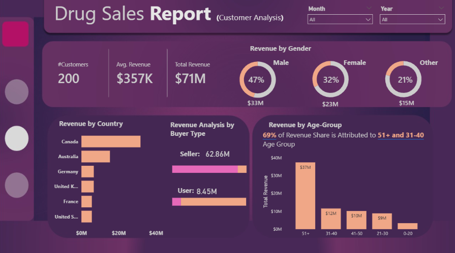
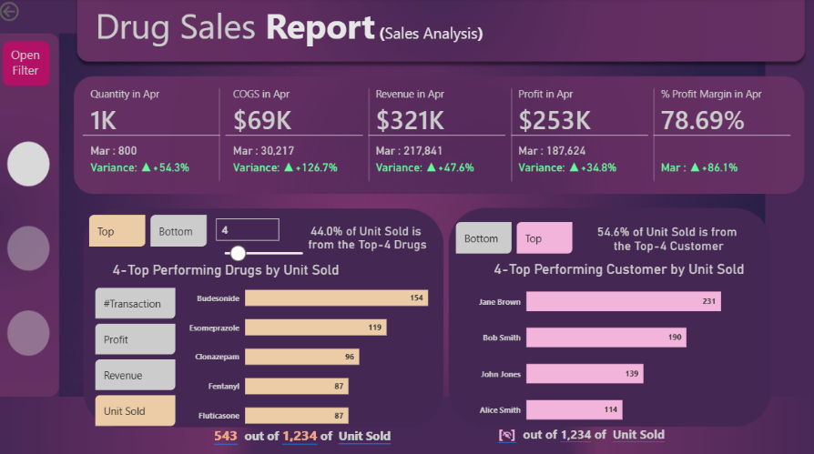

# 📊 Sales Performance Analysis of Pharmaceutical Drugs

  

---

## 🔹 Project Overview
This project presents an interactive **Microsoft Power BI** dashboard developed to analyze pharmaceutical sales performance.  
The dashboard provides insights into revenue trends, profit margins, customer contributions, and product performance to support data-driven decision-making.

---

## 🛠 Tools & Technologies Used

  
  
  
  

---

## 📂 Dataset Information
The project uses pharmaceutical sales data including:
- Sales Data
- Customer Data
- Product Data

All datasets are available in the **Data/** folder.

---

## 📈 Dashboard Preview

  

  

---

## 🔍 Key Features
- 📌 Total Revenue, Profit, and COGS Analysis  
- 📌 Profit Margin % Calculation using DAX  
- 📌 Top/Bottom Performing Drugs Analysis  
- 📌 Customer Contribution Analysis  
- 📌 Revenue by Gender, Country, and Age Group  
- 📌 Interactive Filters & Dynamic Slicers  

---

## 📊 Key Insights
- Identified high and low performing pharmaceutical products.
- Analyzed customer demographics contributing to maximum revenue.
- Measured profitability using dynamic DAX measures.
- Enabled business users to monitor sales trends interactively.

---

## 🚀 How to Use This Project

1. Download or clone the repository.
2. Open the `.pbix` file inside the **Dashboard/** folder using **Microsoft Power BI Desktop**.
3. If required, reconnect the data source to the CSV files in the **Data/** folder.
4. Click **Refresh** to load data.

---

## 👨‍💻 Author
Your Name  
Power BI Developer | Data Analyst  